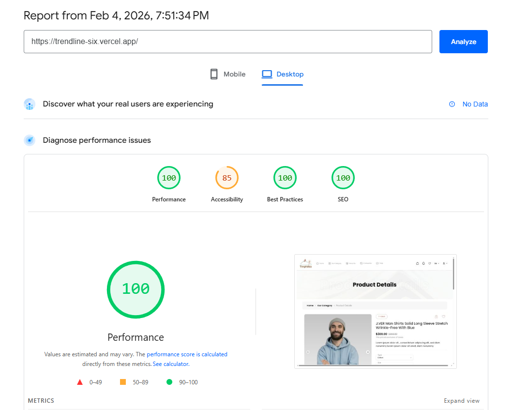
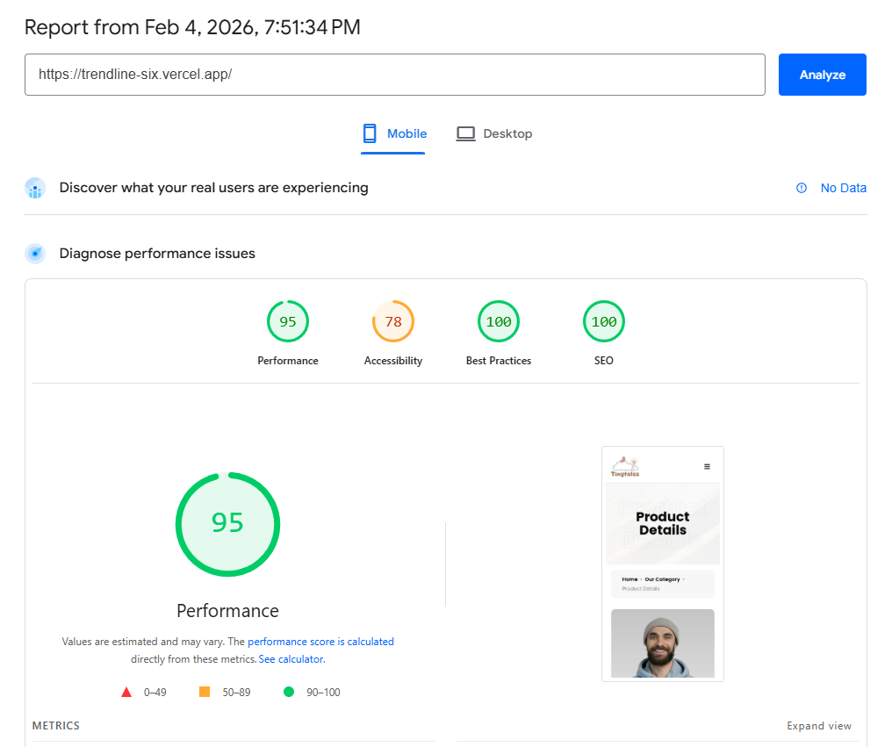

# Trendline – Frontend Task (Next.js)

A frontend implementation for an authentication flow and UI task using **Next.js**, built as part of a technical assignment.

The project includes:

- Full authentication flow (Register, Login, Verify)
- Protected routes
- Pixel-perfect & responsive UI implementation
- API integration
- Performance & SEO optimization

---

## 🚀 Live Demo

🔗 **Live Demo:**  
(ضع رابط Vercel هنا)  
`https://trendline-six.vercel.app/`

🔗 **Repository:**  
https://github.com/YoussefTurkey/trendline

---

## 🧩 Features

### 🔐 Authentication Flow

- **Register Page**
  - Full Name
  - Email
  - Password
  - Phone Number
  - Country Code
- **Login Page**
  - Email
  - Password
- **Verify Account Page**
  - Verification code input
  - ✅ Test verification code: `123456`
- **Dashboard**
  - Protected route
  - Displays: `Welcome, [User Name]`

### 🛡️ Protected Routes

- Implemented using **NextAuth**
- Middleware-based route protection
- Unauthorized users are redirected to Login

---

## 🎨 User Interface

- Pixel-perfect implementation based on the provided UI mockup
- Fully responsive (Desktop & Mobile)
- Built with:
  - Tailwind CSS
  - shadcn/ui
  - Lucide Icons
  - Embla Carousel

---

## ⚡ Performance & SEO

- Lighthouse scores:
  - **Performance:** 90+
  - **SEO:** 90+
- Optimized images & components
- Proper metadata handling

---

## 🧰 Tech Stack

- **Framework:** Next.js (App Router)
- **Language:** TypeScript
- **Authentication:** NextAuth
- **Forms:** React Hook Form + Zod + Resolver
- **HTTP Client:** Axios
- **UI & Styling:**
  - Tailwind CSS
  - shadcn/ui
  - Lucide React
  - Embla Carousel
- **Notifications:** react-hot-toast

---

## 🔗 API Integration

- APIs were integrated according to the provided Postman Collection:
  - Register
  - Login
  - Verify Account
- Token is securely handled and stored after successful authentication.
- Auth flow fully matches backend requirements.

---

## 🛠️ Installation & Setup

### 1️⃣ Clone the repository

```bash
git clone https://github.com/YoussefTurkey/trendline.git
cd trendline
```

## 📂 Project Structure (Simplified)

```
TRENDLINE/
├── .next/                    # ملفات بناء Next.js التلقائية
├── node_modules/             # حزم التبعيات المثبتة
├── public/                   # ملفات ثابتة (صور، أيقونات، fonts)
├── src/
│   ├── app/                  # هيكل تطبيق Next.js 14 (App Router)
│   │   ├── (auth)/           # مجموعة routes للمصادقة (Route Groups)
│   │   ├── (pages)/          # مجموعة routes للصفحات
│   │   ├── api/              # API Routes
│   │   ├── dashboard/        # صفحة/مجموعة Dashboard
│   │   ├── favicon.ico       # أيقونة الموقع
│   │   ├── globals.css       # الأنماط العامة
│   │   ├── layout.tsx        # Layout الرئيسي
│   │   ├── page.tsx          # الصفحة الرئيسية (Home)
│   ├── components/       # مكونات خاصة بالتطبيق
│   ├── data/             # ملفات البيانات والـ mock data
│   ├── lib/              # مكتبات وأدوات مساعدة
│   ├── providers/        # Providers السياق (React Context)
│   └── types/            # تعريفات TypeScript
├── .env.local                # متغيرات البيئة المحلية
├── .gitignore                # ملفات/مجلدات مستثناة من Git
├── components.json           # إعدادات لـ shadcn/ui إن وجد
├── eslint.config.mjs         # إعدادات ESLint
├── middleware.ts             # Middleware لـ Next.js
├── next-env.d.ts            # تعريفات TypeScript لـ Next.js
└── next.config.ts           # إعدادات Next.js
```

## ✅ Task Requirements Checklist

- Register Page with API integration
- Login Page with API integration
- Verify Account Page (Code: 123456)
- Token handling & protected routes
- Pixel-perfect UI implementation
- Fully responsive design
- GitHub repository
- Live deployment
- README with setup instruction

## 📸 Screenshots

### Desktop Rate



### Mobile Rate



## 👨‍💻 Author

Youssef Turkey
Frontend Engineer (Next.js)
GitHub: https://github.com/YoussefTurkey
([LinkedIn](https://www.linkedin.com/in/youturkey11/))
